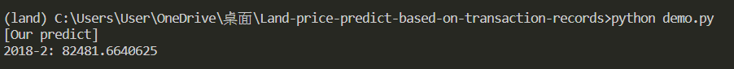

# PropGman: Regional-index-predict-based-on-transaction-records


## Taget 🎯
本研究希望建立一套通用流程，透過實價登錄資料，對土地價值進行預測，幫助不論是公部門或是相關人士在對於土地資產活化的評估與決策中，一些過去需以人工經驗、認知判斷的因素與指標，通過一種更為客觀有依據的方法進行更精準的預測。
影響土地的價值有許多不同的指標，本研究選以「一段時間與區域範圍內的土地交易之平均每坪土地交易價值」為範例目標進行深入討論與研究，並期許於未來可以將此流程與方法擴展至其他指標上，進行更全面、完善的探討與運用，達到真正的資產活化與效益最大化。

## Result 
### `每月單位土地價`
每個月在目標土地中心 3000 公尺內的土地交易(時價登入)的「單價元平方公尺」平均值。
| Group | MAE | RMSE | MAPE |
| --- | --- | --- | --- |
| 0 | 8559 | 11221 | 0.1200 |
| 1 | 13177 | 15033 | 0.1714 |
| 2 | 4725 | 6197 | 0.1551 |
| 3 | 12471 | 15810 | 0.1817 |
| 4 | 36140 | 43242 | 0.5367 |
| 5 | 36388 | 37937 | 0.6182 |
| 6 | 18018 | 20783 | 0.3152 |
| 7 | 4718 | 6186 | 0.2148 |
| 8 | 3126 | 4391 | 0.1766 |
| 9 | 27635 | 32195 | 0.4216 |
| 10 | 8805 | 10027 | 0.3290 |
|  |  | avg. | 0.29 |

### `每月交易量`
每個月在目標土地中心 3000 公尺內的土地交易(時價登入)的數量。
| Group | MAE | RMSE | MAPE |
| --- | --- | --- | --- |
| 0 | 16.3 | 22.4 | 0.4673 |
| 1 | 16.3 | 20.5 | 0.4492 |
| 2 | 8.6 | 10.5 | 0.4751 |
| 3 | 10.3 | 12.3 | 0.3869 |
| 4 | 8.3 | 10.2 | 0.7115 |
| 5 | 7.5 | 8.9 | 1.1352 |
| 6 | 4.3 | 4.4 | 0.7005 |
| 7 | 7.5 | 9.5 | 0.4964 |
| 8 | 7.5 | 8.6 | 0.4324 |
| 9 | 10.8 | 13.2 | 1.8828 |
| 10 | 7.9 | 10.5 | 0.6284 |
|  |  | avg. | 0.706 |

## `Demo`
### input
| year | month | group_center | refer_point1 | refer_point2 | refer_point3 | refer_point4 | group |
| --- | --- | --- | --- | --- | --- | --- | --- |
| 2017 | 11 | 63555 | 57228 | 73875 | 63721 | 37824 | 0 |
| 2017 | 12 | 47273 | 40341 | 49434 | 58276 | 32960 | 0 |
| 2018 | 1 | 45804 | 60585 | 44698 | 46390 | 34342 | 0 |


### our predict
```
python demo.py
```


ps. 答案為 72275，雖然差了1萬左右，但是以趨勢來看，表現不錯。

# Reproduce
## 📁 Folder schema 
```
- PropGman
    |-- method: 我們的方法
    |-- model: 原始 gman code

- EDA_and_preprocess
    |-- code: 資料爬蟲、前處理、探勘過程
        |--data_procces
        |--method_procces
        |--supplementary: 非過程中的其他參考程式碼

- configs
- data 
    |-- input: 整理過的資料，包含目標土地 & 時價登入
    |-- train_data: 訓練用資料

- output
- scripts: shell or batch 腳本，包含批次跑實驗、訓練範例
- doc
- img

- requirements.txt: python 依賴套件
- data_helper.py: 將輸入資料(data/input)依造參數設定檔(configs)轉換成訓練資料(data/train_data)
- train.py: 主要訓練程式碼
```
## 🖥️ Environment settings 
### `code`
```shell
git clone https://github.com/aaron1aaron2/PropGman__Regional-index-predict-based-on-transaction-records.git
```
### `pytorch`
本專案是在 window 11、cuda(11.6)、pytorch(1.12.1)測試。
如使用不同環境請到 [pytorch 官網](https://pytorch.org/) 選擇對應版的指令。
```shell
pip3 install torch torchvision torchaudio --extra-index-url https://download.pytorch.org/whl/cu116
```

### `other packages`
```shell
pip3 install -r requirements.txt
```
## 🙋 Quick start 
### `Step1: 資料準備`
主要資料位於 *data/input* 底下。
- target.csv: 目標土地資料 + 土地經緯度
- transaction.csv: 時價登入資料 + 土地經緯度

p.s. 土地經緯爬取與資料前處理流程請參考 *EDA_and_preprocess*

### `Step2: 產生訓練資料`

```shell
python data_helper.py --config_path configs/Basic.yaml
```
p.s. 可以到 *configs* 資料夾底下複製模板，並依自己的需求客製化自己的 config 檔。

### `Step3: 訓練模型`
```shell
scripts\train_basic.bat
```
or
```shell
source scripts/train_basic.sh
```
p.s. *scripts* 底下有批次跑實驗模板，可以參考。
# Other information
## Our team
|姓名|學校|系級|github|
|-|-|-|-|
|何彥南|國立政治大學(NCCU)|資科碩二(智慧計算組)|https://github.com/aaron1aaron2|
|莊崴宇|國立政治大學(NCCU)|資科碩二(一般組)||https://github.com/C-WeiYu|
|周倢因|國立台灣科技大學(NTUST)|資科碩二|

## Code Source (GMAN)
[](https://github.com/VincLee8188/GMAN-PyTorch)

## Citation

This version of implementation is only for learning purpose. For research, please refer to  and  cite from the following paper:
```
@inproceedings{ GMAN-AAAI2020,
  author = "Chuanpan Zheng and Xiaoliang Fan and Cheng Wang and Jianzhong Qi"
  title = "GMAN: A Graph Multi-Attention Network for Traffic Prediction",
  booktitle = "AAAI",
  pages = "1234--1241",
  year = "2020"
}
```
